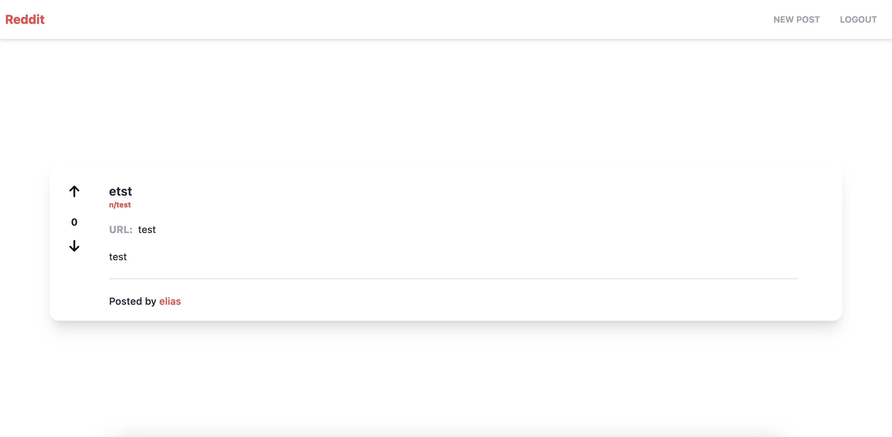
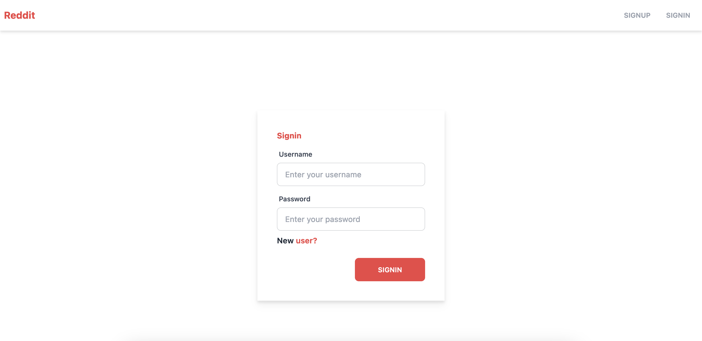
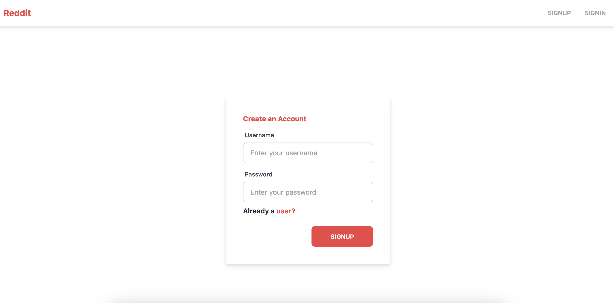
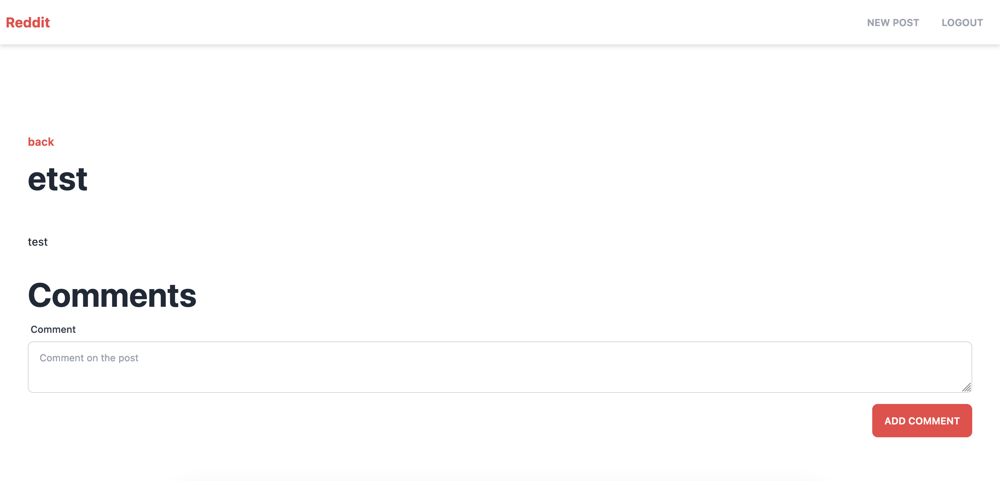

# Screenshots

Home Feed


Signin page


Signup page


Post page


# To Run

## Install

```bash
yarn install
```

## Environment Variables
(**Note: Refer to [`.env.example`](./.env.example) for an example of the environment variables**)

## Run
```bash
yarn dev
```